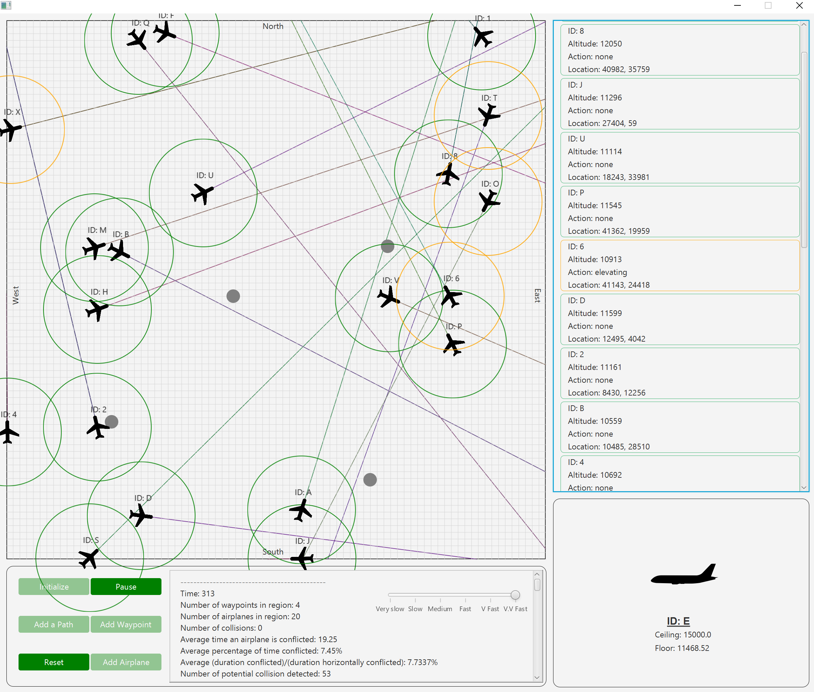

# Automated ATC
This application is a simple automated en-route air traffic control system. It was built for my final year undergraduate project at the University of Manchester.

If you would like a detailed explanation of how the application works, please refer to the [report](final_report.pdf) that was written for the application.

## Requirements
Make sure to use Java 8 (unfortunately, external libraries that were used do not work with newer versions of Java).  
To run the application, double-click on the jar file located in the root folder (ATC.jar) or execute the following command: 
``` 
java -jar ATC.jar
```
